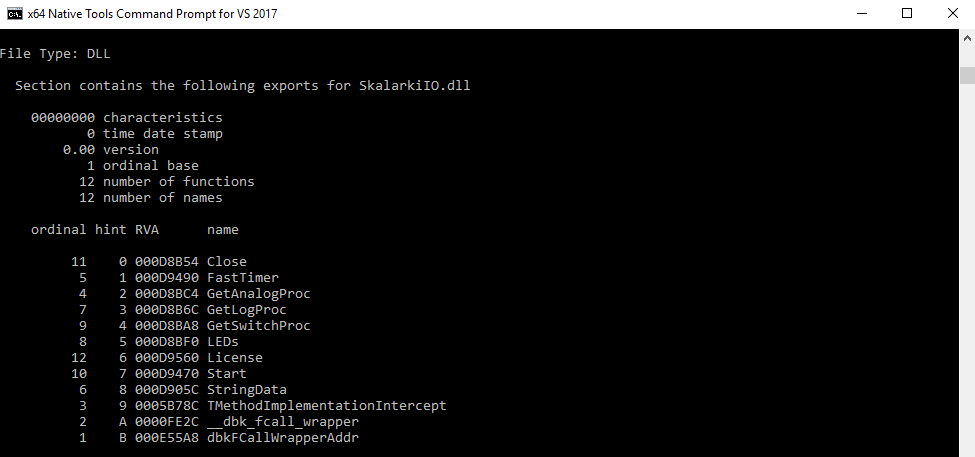

# Introduction
Le module Hardware connect de FMGS reçoit les donées des composantes matérielles par le biais du driver Skalarki. Il les trasmet ensuite à FMGS et Prepar3d. Cette communication (entre Hardware connect et Skalarki) se fait par grâce à une Dynamic Link Library (dll). Celle-ci est déjà intégrée dans le dossier Hardware connect de FMGS.

Le développeur JeeHells nous a fournis une documentation et un exemple d'implémentation de cette dll.

# Créer sa dll
J'ai donc créer ma propre dll afin de comprendre comment se fait la communication.
Pour cela, j'ai commencé par inspecter l'architecture de la dll existante SkalarkiIO avec l'outil dumpbin de Microsoft Visual Studio.

Dans la console Native tool de Virtual studio, taper : **dumpbin /EXPORTS "destinationdeSkalarkiIO/SkalarkiIO.dll"**.



On obtient la liste des fonctions exportées dans cette dll. Je sais alors quelles sont les fonctions indispensables à implémenter dans ma dll.

Pour créer cette dll, j'ai utilisé l'IDE Visual Studio C++. J'ai suivi la [documentation officiel](https://msdn.microsoft.com/fr-fr/library/ms235636.aspx) pour créer mon projet.
J'y ai inclus le code fourni par JeeHells. Donc le main.h, main.cpp et le fichier .def définissant les fonctions à exporter.

Afin de faire fonctionner ce code, j'ai modifié les typedef des pointeurs de fonction :

```cpp
typedef int (__stdcall TSW_PROC)(int switchnb, int dir);
TSW_PROC* SW_PROC;

typedef int (__stdcall Tlog_PROC)(PCHAR ModuleName, PCHAR text); //PCHAR = char*
Tlog_PROC* log_PROC;
```

Avant de générer la dll, afin que celle-ci soit utilisable sur les ordinateurs ne possédant pas Visual Studio je suis allé dans l'onglet **Projet > Propriété de "NomDuProjet"**. J'ai mis la configuration en mode Debug et la plateforme en win32 ou x86.

Je suis également, dans le menu déroulant, allé dans **Propriétés de configuration > C/C++ > Génération de code** et j'ai mis le champ **Bibliothèque Runtime** sur **Débogage multithread (/MTd)**.

En effet, la dll ne fonctionnant pas parfaitement j'ai utilisé le mode débogage, ce qu'il faudra modifier plus tard.

J'ai ensuite généré la dll, que j'ai récupéré et inclus dans le dossier Hardware connect de FMGS.
On peut ensuite lancer Hardware connect qui reconnait la nouvelle dll et l'ancienne (si celle-ci est encore dans le dossier).

# Modifications apportées

Afin de comprendre comment cette librairie est utilisée j'ai procédé à un affichage des fonctions et paramètres de celles-ci dès lors qu'elles sont utilisées. J'ai pu ainsi voir à quels moments Hardware connect appel les procédures en fonction du matériel connecté.

Pour faire ceci, j'ai inclus dans toutes les fonctions un appel à la procédure définie dans le typedef log_PROC.
```.cpp
log_PROC("Mon texte", "Mon texte");
```
J'ai utilisé cette méthode car c'est le seul moyen que j'ai trouvé pour afficher des informations sur la fenêtre Hardware module.


