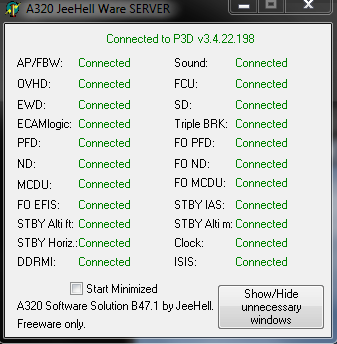

# FMGS par JeeHell

## Introduction

La suite FMGS est un ensemble de plusieurs modules s'interfaçant avec les logiciels Prepar3D et/ou Flight Simulator X ainsi que Skalarki pour les composantes matérielles. Cette suite logicielle permet l'affichage des données de simulation sur des écrans typés avioniques et des virtualisations des pièces matérielles. Ces derniers permettent alors au pilote d'avoir ses instruments sous les yeux.

FMGS permet également la connexion de plusieurs périphériques externes (instruments physiques de pilotage)
au le logiciel de simulation (P3D ou FSX). On a ainsi une simulaton bien plus réaliste.

La documentation officielle est disponible en ligne :
- [Manuel d'installation](http://www.jeehell.org/FR%20-%20Manuel%20d'installation.pdf)
- [Manuel d'utilisation](http://www.jeehell.org/FR%20-%20Manuel%20d'utilisation.pdf)
- Manuel expert accessible dans le dossier A320FMGS après l'installation.

## Installation

FMGS est installé sur 2 ordinateurs différents, l'un jouant le rôle du serveur et l'autre celui du client.
Le serveur s'interface avec Prepar3d et le client responsable de l'affichage des données et instruments se connecte au serveur.
On peut également tout installer sur un seul ordinateur en guise afin de tester la connectivité mais les performances seront amoindries.

### PC Serveur

Ordinateur sur lequel Prepar3d est installé (donc le plus puissant).
Récupérer l'executable de la [dernière version de l'installer FMGS](http://aircockpit.com/viewtopic.php?f=173&t=5797) (à ce jour B47.1).

Dans l'assistant d'installation "Select Components" ne cocher que :
- Master FSX/P3D PC et FMGS Server and AP/FBW
- FSUIPC Support et SKALARKI I/O de "Hardware Modules"

A la fin de l'installation une fenêtre "Configure" apparaît. Renseigner les 2 premiers champs avec l'addresse IP de cet ordinateur (PC Serveur). Laisser les autres champs par défaut.

Une autre fenêtre s'ouvre, cliquer sur "Save Controls Configuration" puis la fermer.

### PC Client

Sur un ordinaeur différent.
Lancer l'exécutable de l'installer FMGS.

Dans l'assistant d'installation "Select Components" cocher :
- Toutes les options de "Main Application" mis à part Master FSX/P3D PC et FMGS Server and AP/FBW
- SKALARKI I/O de "Hardware Modules"
- Toutes les options de "Software panels interface"

Dans la fenêtre "Configure" renseigner les 2 premiers champs avec l'addresse IP de l'ordinateur serveur. Laisser les autres champs par défaut.

### Ordinateur unique (test FMGS)

Lancer l'exécutable de l'installer FMGS.

Dans l'assistant d'installation "Select Components" cocher :
- Toutes les options de "Main Application"
- FSUIPC Support et SKALARKI I/O de "Hardware Modules"
- Toutes les options de "Software panels interface"

## Exécution

### PC Serveur / PC Client
Sur le pc serveur :
- Démarrer la simulation Prepar3d.
- Lancer l'éxecutable Starter du dossier principal (A320FMGS).

Sur le pc client :
- Lancer l'éxecutable Starter du dossier principal (A320FMGS).
- Il est possible de configurer les différents modules éxécutés par le Starter. Pour ce faire, éditer le fichier Starter.ini.
- Le client est connecté au serveur et reçoit les données de Prepar3d.

La fenêtre FMGS_Server doit maintenant détecter les différents modules du client et les indiquer comme "Connected".

### Ordinateur unique

Démarrer la simulation Prepar3d.
Dans le dossier FMGS Server de A320FMGS lancer FMGS_Server.
Lancer l'éxecutable Starter du dossier principal (A320FMGS).
La fenêtre FMGS_Server doit maintenant détecter les différents modules du client et les indiquer comme "Connected".
