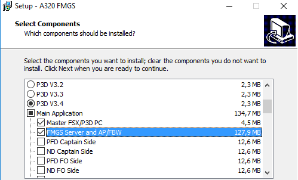
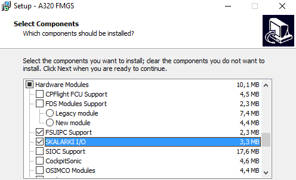
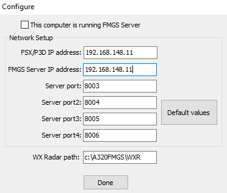

# FMGS par JeeHells

## Introduction

La suite FMGS est un ensemble de plusieurs modules s'interfaçant avec les logiciels Prepar3D et/ou Flight Simulator X ainsi que Skalarki pour les composantes matérielles. Cette suite logicielle permet l'affichage des données de simulation sur des écrans typés avioniques et des virtualisations des pièces matérielles. Ces derniers permettent alors au pilote d'avoir ses instruments sous les yeux.

FMGS permet également la connexion de plusieurs périphériques externes (instruments physiques de pilotage)
au le logiciel de simulation (P3D ou FSX). On a ainsi une simulaton bien plus réaliste.

## Installation
### Environnement

FMGS est installé sur 2 ordinateurs différents, l'un jouant le rôle du serveur et l'autre celui du client.
Le serveur s'interface avec Prepar3d et le client responsable de l'affichage des données et instruments se connecte au serveur.

#### Un unique ordinateur Serveur/Client

#### PC Serveur

Ordinateur sur lequel Prepar3d est installé.
Récupérer l'éxecutable de la [dernière version de FMGS](http://aircockpit.com/viewtopic.php?f=173&t=5797) (à ce jour B47).

Dans l'assistant d'installation ne cocher que :
- Master FSX/P3D PC et FMGS Server and AP/FBW
- FSUIPC Support et SKALARKI I/O

 

A la fin de l'installation une fenêtre "Configure" apparaît. Renseigner les 2 premiers champs avec l'addresse IP de cet ordinateur (PC Serveur). Laisser les autres champs par défaut.

Une autre fenêtre "Configure Control" s'ouvre, cliquer sur "Set Control".
